# Changelog

## Unreleased

### README / Profile
- 将 `README.md` 的主视觉统一为 CRT 风格横幅，当前顶部只展示 `assets/banners/crt-banner.gif`。
- 放弃早期信息过长、结构松散的 profile 呈现，收敛为更聚焦的 banner-first 方案。
- 将 README 中对旧路径 `assets/crt_banner.gif` 的引用更新为新的规范路径。

### CRT Banner
- 重写并持续打磨 `tools/generate_crt_banner.py`，将其确立为当前主路线横幅生成器。
- 横幅生成路线从“程序化像素人物”逐步切换为“原图直接融入 CRT 屏幕”，以保留眼睛、发丝、表情和手势等关键细节。
- 左侧人物区改为直接读取 `images/portraits/portrait-reference.jpg`，并叠加 CRT 风格的扫描线、泛光、闪烁、暗角和显示器质感。
- 调整左侧图像裁切范围，使原图内容显示更多，不再过度近景裁切。
- 减弱左侧整体绿调，恢复原图的眼睛、发丝和面部层次。
- 保留右侧终端信息面板和整体 CRT 外框风格，使横幅更像“原图进入老显示器”，而不是“人物被重新像素化”。
- 为右侧 `PROFILE.SYS` 标题增加轻量 glitch 切片效果，使少数动画帧出现终端信号扰动，同时保持标题可读。

### Right Panel
- 将右侧信息面板升级为 `PROFILE.SYS / ONLINE` 风格的 CRT terminal profile，并增加顶部状态线与像素状态点。
- 移除 `OS` 字段，减少无关系统描述。
- 将 `Work` 字段更新为 `BIT CS` 与 `Agent Engineer` 两行展示。
- 将 `Editor` 字段扩展为 `Cursor / VS Code`、`Claude Code / Codex`、`OpenCode / Trae`。
- 将 `Languages` 字段压缩为三行展示：`Python, CUDA, C/C++`、`TypeScript, JavaScript`、`Bash, Go`。
- 将 `Skills` 字段优化为更聚焦的英文方向：`Agentic coding systems`、`LLM evals & benchmarks`、`AI infra & training`、`Context engineering`。
- 移除 `Recent` 字段，并替换为 `Experience` 字段，概括展示 `AI researcher & builder`、`Open-source agent projects`、`Model eval / benchmarks`、`Research-to-product demos`。
- 收紧右侧排版间距与字号，统一多行字段的 `>` 子项缩进，避免右侧文本拥挤。

### Metrics / Widgets / Workflows
- 保留并恢复 `metrics` 路线能力，但不再作为 README 当前主视觉展示。
- 整理 `.github/workflows/metrics.yml`，保留 `header`、`activity`、`repositories`、`metadata`、`languages`、`lines`、`stargazers`、`habits` 等插件路线。
- 为 `metrics` 路线加入可选的 `WakaTime` 集成配置，支持通过 `WAKATIME_TOKEN` 条件启用。
- 保留 trophies 更新路线，并将资源迁移到 `assets/widgets/trophies.svg`。
- 更新 `.github/workflows/update-trophies.yml`，使其适配新的资源目录结构。
- 调整 `.github/workflows/snake.yml` 的 `color_dots` / `color_snake`，使贡献 snake 图采用 CRT 终端绿渐变，替代默认 `github` / `github-dark` preset。

### Asset Structure
- 对 `assets` 和 `images` 做了规范化整理，确立规则：普通原始图片放在 `images`，展示资源、生成结果和中间产物放在 `assets`。
- 新建 `images/portraits/`，用于存放人物原图和参考图。
- 新建 `images/logos/`，用于存放 logo 和 icon 类图片。
- 新建 `assets/banners/`，用于存放 README 横幅和其他 banner 输出。
- 新建 `assets/widgets/`，用于存放 `trophies.svg` 这类非 banner 资源。
- 新建 `assets/intermediate/`，用于存放 `ascii-base.png` 这类中间产物。
- 新建 `assets/animations/`，用于存放 `code.gif` 这类动画资源。
- 将多份人物图统一归档到 `images/portraits/`。
- 将 logo / icon 图片统一归档到 `images/logos/`。
- 将 banner 输出统一归档到 `assets/banners/`。
- 将 trophies 统一归档到 `assets/widgets/`。
- 将历史 ASCII 中间产物统一归档到 `assets/intermediate/`。
- 对资源文件进行了更规范的 kebab-case 重命名，例如 `crt_banner.gif` 调整为 `crt-banner.gif`，`header_profile.svg` 调整为 `header-profile.svg`。

### 项目结构

> 当前仓库目录概览。规则：`images/` 存放原始图片，`assets/` 存放展示资源、生成结果与中间产物；下方仅列出主要目录与关键文件。

```mermaid
flowchart TB
    ROOT(["NJX-njx/"])

    ROOT --> DOCS
    ROOT --> ASSETS
    ROOT --> IMAGES
    ROOT --> TOOLS
    ROOT --> GH

    subgraph DOCS["根目录 — 文档与配置"]
        direction TB
        README["README.md<br/>GitHub Profile 主页，顶部展示 CRT 横幅"]
        CHANGELOG["CHANGELOG.md<br/>变更记录与结构说明"]
        METRICS["github-metrics.svg<br/>GitHub Metrics 自动生成的 SVG"]
        REQ["requirements.txt<br/>banner 生成脚本 Python 依赖"]
        GITIGNORE[".gitignore<br/>忽略 Python 缓存与 .venv"]
    end

    subgraph ASSETS["assets/ — 展示资源与生成结果"]
        direction TB
        BANNERS["banners/<br/>横幅输出（crt-banner.gif 等）"]
        WIDGETS["widgets/<br/>小组件（trophies.svg）"]
        ANIM["animations/<br/>动画资源（code.gif）"]
        INTER["intermediate/<br/>中间产物（ascii-base.png）"]
    end

    subgraph IMAGES["images/ — 原始图片"]
        direction TB
        PORTRAITS["portraits/<br/>人物原图与参考图"]
        LOGOS["logos/<br/>Logo / Icon 类图片"]
    end

    subgraph TOOLS["tools/ — 本地生成脚本"]
        direction TB
        CRT["generate_crt_banner.py<br/>当前主路线 CRT 横幅生成器"]
        LEGACY["generate_*.py<br/>历史 banner 生成脚本"]
        TOOLREADME["README.md<br/>环境初始化与重新生成说明"]
    end

    subgraph GH[".github/workflows/ — CI 自动更新"]
        direction TB
        METRICS_WF["metrics.yml<br/>GitHub Metrics 定时生成"]
        TROPHIES_WF["update-trophies.yml<br/>Trophies 资源更新"]
        SNAKE_WF["snake.yml<br/>贡献 snake 图生成"]
    end
```



```text
NJX-njx/
├── README.md                         # GitHub Profile 主页
├── CHANGELOG.md                      # 变更记录（本文件）
├── github-metrics.svg                # GitHub Metrics 自动生成 SVG
├── requirements.txt                  # banner 脚本 Python 依赖（Pillow）
├── .gitignore                        # 忽略 Python 缓存与 .venv
├── assets/                           # 展示资源、生成结果、中间产物
│   ├── banners/                      # 横幅输出（crt-banner.gif 为主视觉）
│   ├── widgets/                      # 小组件（trophies.svg）
│   ├── animations/                   # 动画资源（code.gif）
│   └── intermediate/                 # 生成中间产物（ascii-base.png）
├── images/                           # 原始图片素材
│   ├── portraits/                    # 人物原图与参考图
│   └── logos/                        # Logo / Icon 类图片
├── tools/                            # 本地 banner 生成脚本
│   ├── README.md                     # 环境初始化与生成命令说明
│   ├── generate_crt_banner.py        # 当前主路线 CRT 横幅生成器
│   └── generate_*.py                 # 历史 banner 生成脚本
└── .github/workflows/                # GitHub Actions 工作流
    ├── metrics.yml                   # GitHub Metrics 定时生成
    ├── update-trophies.yml           # Trophies 资源更新
    └── snake.yml                     # 贡献 snake 图生成
```

### Tooling Cleanup
- 更新 `.gitignore`，忽略 Python 缓存、`.pyc` 文件和本地 `.venv/`。
- 从仓库中移除已提交的 `tools/__pycache__/*.pyc` 缓存文件。
- 新增 `requirements.txt`，记录 banner 生成脚本所需的 Pillow 依赖。
- 新增 `tools/README.md`，说明本地环境初始化与 CRT banner 重新生成命令。
- 清理 `tools/generate_crt_banner.py` 中的 `debugging:` 输出，仅保留生成成功后的简洁 `Saved:` 提示。
- 统一整理 `tools` 目录下多支历史 banner 生成脚本的说明文字与输出约定。
- 为 `generate_banner.py`、`generate_arch_banner.py`、`generate_interactive_banner.py`、`generate_pro_banner.py`、`generate_profile_banner.py`、`generate_final_banner.py`、`generate_crt_banner.py` 补充或统一模块说明。
- 统一这些脚本的输出路径风格，使其全部指向新的 `assets/banners/` 或对应规范目录。
- 统一这些脚本的入口写法，使其从项目根目录解析路径，而不是依赖脆弱的相对字符串。
- 为旧脚本补充输出目录自动创建逻辑，减少未来运行时因目录不存在导致的失败。
- 将 `generate_final_banner.py` 的中间输入路径更新为 `assets/intermediate/ascii-base.png`。
- 将 `generate_profile_banner.py` 与 `generate_final_banner.py` 的人物素材路径更新为 `images/portraits/`。

### Verification
- 使用 `actionlint` 对 `.github/workflows/*.yml` 进行 GitHub Actions 体检。
- 多次重新生成当前主横幅 `assets/banners/crt-banner.gif`，确保视觉调整真实落地。
- 在新目录结构下实际运行 `tools/generate_crt_banner.py`，确认新路径可正常读取与输出。
- 使用 `ReadLints` 检查关键文件，未发现新增 lint 问题。
- 使用 `python -m py_compile` 对多支 banner 脚本进行语法检查，结果通过。
- 扫描旧路径引用，未发现仍指向旧目录结构的文本残留。
