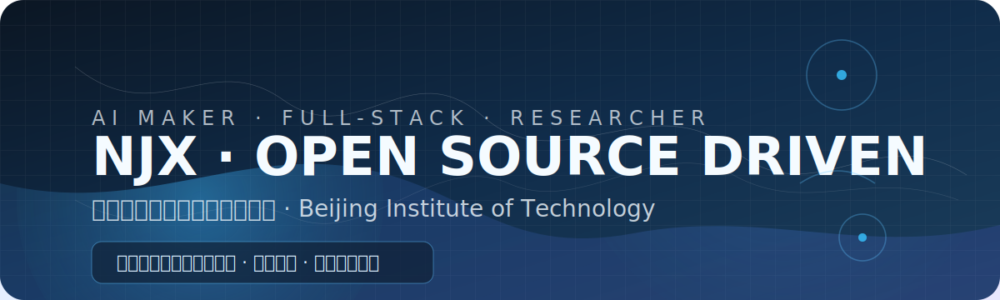

<div align="center">
  
</div>

<p align="center">
  <a href="#-mission-control">Mission Control</a> ·
  <a href="#-pinned">Pinned</a> ·
  <a href="#-labs-playground">Labs & Playground</a> ·
  <a href="#-tech-universe">Tech Universe</a> ·
  <a href="#-live-telemetry">Live Telemetry</a> ·
  <a href="#-connect">Connect</a>
</p>

<p align="center">
  <a href="https://github.com/NJX-njx">
    
  </a>
</p>

---

## 🚀 Mission Control

```
┌────────────────────────────────────────────────────────────┐
│ NJX / 001 · status: OPERATIONAL                            │
│ focus: multimodal foundation models · vision intelligence  │
│ mode : shipping-impact · research-driven                   │
└────────────────────────────────────────────────────────────┘
```

- 🎓 **北京理工大学 · CS 在读** —— 机器视觉 & 多模态感知
- 🧠 **AI 大模型与 Agent 架构探索者** —— 关注模型可解释性与应用落地
- 🧰 **全栈实践者** —— 从模型训练、MLOps 到前端体验的端到端产品化
- ☁️ **开源贡献者** —— 将实验室里的 idea 变成可复用的工具

> 「把科研里的灵感变成真实世界的体验，是我每天写代码的理由。」

---

## 📌 Pinned


| 仓库 | 简介 |
| --- | --- |
| <a href="https://github.com/NJX-njx/YOLOv8-pt">YOLOv8-pt</a> <sub>• Python</sub> | 自主优化视觉检测 pipeline，融合自蒸馏与数据合成策略；推理速度提升约 18%。 |
| <a href="https://github.com/NJX-njx/game-demo">game-demo</a> <sub>• TypeScript</sub> | 基于 WebGL/WebGPU 的交互式小游戏实验场，探索实时渲染与物理。 |
| <a href="https://github.com/NJX-njx/gemini-cli">gemini-cli</a> <sub>• TypeScript</sub> | 便捷的多模态 LLM 命令行助手，支持流式输出与多轮上下文。 |
| <a href="https://github.com/NJX-njx/explainai">explainai</a> <sub>• Python</sub> | 面向可解释性的可视化工具箱，提供 Grad-CAM/Attention rollout 等。 |

---

## 🧪 Labs & Playground

<div align="right">
  <!-- 绿色脉冲点：data URI 内联 SVG，兼容 GitHub 渲染 -->
  
  <svg xmlns='http://www.w3.org/2000/svg' viewBox='0 0 24 24'>
    <defs>
      <radialGradient id='g' cx='50%' cy='50%' r='50%'>
        <stop offset='0%' stop-color='%2334d399' stop-opacity='1' />
        <stop offset='100%' stop-color='%2334d399' stop-opacity='0' />
      </radialGradient>
    </defs>
    <circle cx='12' cy='12' r='3' fill='%2322c55e'>
      <animate attributeName='r' values='3;6;3' dur='1.8s' repeatCount='indefinite' />
      <animate attributeName='opacity' values='1;0.6;1' dur='1.8s' repeatCount='indefinite' />
    </circle>
    <circle cx='12' cy='12' r='10' fill='url(%23g)'>
      <animate attributeName='r' values='6;12;6' dur='1.8s' repeatCount='indefinite' />
      <animate attributeName='opacity' values='0.35;0;0.35' dur='1.8s' repeatCount='indefinite' />
    </circle>
  </svg>" />
</div>

| 模块 | Capsule | 亮点 |
| --- | --- | --- |
| **Vision Flow** | <circle cx='12' cy='12' r='4' fill='%2322c55e'><animate attributeName='r' values='3;4.5;3' dur='1.6s' repeatCount='indefinite'/></circle></svg>" /> [YOLOv8-pt](https://github.com/NJX-njx/YOLOv8-pt) | 自主优化视觉检测 pipeline，融合自蒸馏与数据合成策略，推理速度提升 18%。 |
| **Agent Studio** | <circle cx='12' cy='12' r='4' fill='%23f59e0b'><animate attributeName='r' values='3;4.5;3' dur='1.6s' repeatCount='indefinite'/></circle></svg>" /> *即将开源* | 多模态 Agent 工作台，支持视觉问答、知识库检索、流程可视化。 |
| **Interactive CV** | <circle cx='12' cy='12' r='4' fill='%230ea5e9'><animate attributeName='r' values='3;4.5;3' dur='1.6s' repeatCount='indefinite'/></circle></svg>" /> [体验 Demo](https://github.com/NJX-njx?tab=repositories) | 用 WebGPU + Three.js 构建的实时 3D 简历，让科研成果可“看见”。 |

### 🔭 当前关注的 3 个问题

1. 如何让视觉模型的推理链路更具可解释性？
2. 多模态 Agent 的上下文管理能否做到“可编排”？
3. 前端交互如何与 AI 推理结果协同，创造沉浸式体验？

<details>
  <summary><b>展开查看 · 最近的实验记录</b></summary>

  - 🔬 2025-09 · 完成一个用于工业目检的蒸馏实验，对比 4 种温度系数设置
  - 🛰️ 2025-08 · 构建多模态指标仪表板，从 TOF 深度信息矫正姿态估计
  - 🧭 2025-07 · 联合几位同学共建开源 Agent 工作流模版库

 </details>

---

## 🌌 Tech Universe

<table>
  <tr>
    <td width="50%">
      <h3>Core Stack</h3>
      <ul>
        <li>前端：Vue / Nuxt · React / Next.js · Three.js · Vite</li>
        <li>后端：Go · Python · FastAPI · gRPC · PostgreSQL</li>
        <li>AI：PyTorch · Lightning · OpenVINO · TensorRT</li>
        <li>MLOps：Weights & Biases · MLflow · Docker · K8s</li>
      </ul>
    </td>
    <td width="50%">
      <h3>Design & Ops</h3>
      <ul>
        <li>设计系统：Tailwind · Sass · Radix · Element Plus</li>
        <li>体验追踪：Storybook · Chromatic · Playwright</li>
        <li>效率工具：Neovim + VS Code · Zed · Raycast</li>
        <li>可视化：ECharts · Deck.gl · Observable Plot</li>
      </ul>
    </td>
  </tr>
</table>

<details>
  <summary><b>AI 研究里程碑（2024-2025）</b></summary>

  | 年份 | 事件 | 关键词 |
  | --- | --- | --- |
  | 2025 | 建立「Agent Studio」原型，封装多模态 Agent 编排 | #LLM #Workflow #UI/UX |
  | 2025 | 完成跨模态检索毕业设计，并转化为开源实践教程 | #CLIP #知识蒸馏 |
  | 2025 | 加入学校创新实践基地，启动第一批开源贡献 | #OpenSource #Community |

</details>

---

## 📡 Live Telemetry

<details open>
  <summary><b>GitHub · 近况</b></summary>
  <p align="center">
    
    
  </p>
  <p align="center">
    
  </p>
  <p align="center">
    
  </p>
</details>

<details>
  <summary><b>Target · 2025 OKR</b></summary>
  <ul>
    <li>📚 写完「多模态 Agent 实战手册」，计划 30 篇章节</li>
    <li>🧰 发布 2 个工业视觉相关的开源工具包</li>
    <li>🌍 线下分享 3 次，把实际落地经验讲给更多工程师</li>
  </ul>
</details>

<details>
  <summary><b>下一步要发布的内容（自动更新预留）</b></summary>

  ```md
  <!-- roadmap:auto-update:start -->
  - [ ] 多模态 Agent UI 组件库
  - [ ] YOLO 推理性能可视化仪表板
  - [ ] 学校课题组协作手册
  <!-- roadmap:auto-update:end -->
  ```

</details>

---

## 🤝 Connect

- 📮 邮箱：<a href="">3771829673@qq.com</a>
- 🧾 知乎：<a href="https://www.zhihu.com/people/27-30-70-68-27">@NJX</a>
- 🛰️ GitHub：<a href="https://github.com/NJX-njx">@NJX-njx</a>
- ✉️ 欢迎就 AI / 全栈 / 开源合作随时联系！

<p align="center">
  <sub>最后更新：2025 · stay foolish，stay hungry保持热情。</sub>
</p>
