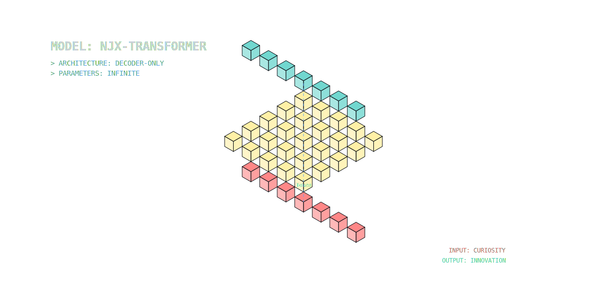
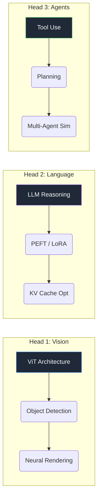
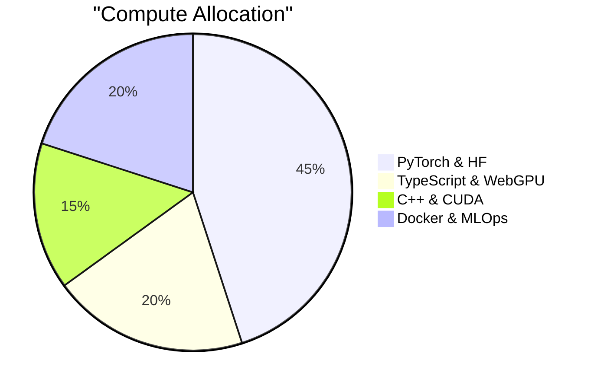

<div align="center">
  
</div>

<div align="center">
  <h3><code>NJX-70B-Instruct</code></h3>
  <p><em>A fine-tuned researcher model optimized for multimodal intelligence and agentic workflows.</em></p>
</div>

---

### 🧠 Model Architecture & Weights

<details open>
<summary><strong>Layer 1: Input Embeddings (Core Identity)</strong></summary>
<br/>

> **"Bridging the gap between SOTA Research and Production Engineering."**

I treat AI research not just as academic exploration, but as **system architecture**. My goal is to understand the emergent properties of large models and engineer the infrastructure that makes them accessible.

*   **Context Window**: Infinite Learner
*   **Training Data**: Computer Vision, LLMs, Distributed Systems
*   **Base Model**: Beijing Institute of Technology (BIT) · CS

</details>

<details>
<summary><strong>Layer 2: Multi-Head Attention (Research Focus)</strong></summary>
<br/>



</details>

<details>
<summary><strong>Layer 3: Feed Forward Networks (Selected Deployments)</strong></summary>
<br/>

| **Tensor** | **Activation** | **Output** |
| :--- | :--- | :--- |
| **[YOLOv8-pt](https://github.com/NJX-njx/YOLOv8-pt)** | `ReLU` | Optimized vision pipeline with self-distillation. **+18% Inference Speed**. |
| **[gemini-cli](https://github.com/NJX-njx/gemini-cli)** | `SiLU` | Terminal-native multimodal assistant. Stream-first architecture. |
| **[explainai](https://github.com/NJX-njx/explainai)** | `Sigmoid` | Visualizing attention maps & Grad-CAM for model transparency. |
| **[game-demo](https://github.com/NJX-njx/game-demo)** | `Tanh` | WebGL/WebGPU physics playground. |

</details>

<details>
<summary><strong>Layer 4: Output Probabilities (Tech Stack)</strong></summary>
<br/>



</details>

---

### 🔌 Inference API (Connect)

```bash
curl -X POST https://api.njx.dev/v1/chat \
  -H "Content-Type: application/json" \
  -d '{
    "model": "njx-researcher",
    "messages": [
      {"role": "user", "content": "Let's collaborate on AI Infra!"}
    ]
  }'
```

<div align="center">
  <a href="mailto:your-email@example.com"></a>
  <a href="https://github.com/NJX-njx"></a>
</div>
