<!-- ╔══════════════════════════════════════════════════════════╗ -->
<!-- ║  NJX-70B-Instruct · GitHub Profile                      ║ -->
<!-- ║  Dynamic SVG Banner + GitHub Metrics + Animated Effects  ║ -->
<!-- ╚══════════════════════════════════════════════════════════╝ -->

<!-- ====== ANIMATED PROFILE BANNER (girl.jpg embedded) ====== -->
<div align="center">
  
</div>

<div align="center">

  <!-- Animated Typing Effect via readme-typing-svg -->
  <a href="https://git.io/typing-svg">
    
  </a>
  
  <br/>

  <!-- Animated Badges / Shields -->
  <a href="https://github.com/NJX-njx"></a>
  <a href="https://github.com/NJX-njx?tab=repositories"></a>
  

</div>

---

<!-- ====== TERMINAL / IDE LAYOUT ====== -->
<div align="center">
  <em>Note: The terminal/command blocks below are for visual flavor only and are not meant to be executed.</em>
</div>

<table>
<tr>
<td valign="top" width="25%">

### 📂 Explorer

```bash
.
├── 📁 core_identity
│   ├── bio.txt
│   └── config.json
├── 📁 research_frontiers
│   ├── vision.py
│   ├── llm.py
│   └── agents.py
├── 📁 deployments
│   ├── yolo_pt
│   └── gemini-cli
└── 📁 telemetry
    └── stats.log
```

<br/>

### 🧠 Model Arch

```yaml
# NJX-Internal-v1
architecture:
  input:
    - source: "Curiosity"
    - dtype: "Raw_Data"
  encoder:
    - layer: "CS_Fundamentals"
    - activation: "Deep_Learning"
  attention:
    - heads: ["Vision", "LLM"]
    - mechanism: "System_Design"
  decoder:
    - task: "Engineering"
    - output: "Innovation"
```

<br/>

### 📦 Packages

```
pip list
─────────────────────
PyTorch        2.x
Transformers   4.x
YOLO           v8
LangChain      0.3
vLLM           latest
OpenCV         4.x
FastAPI        0.11x
Docker         ██████
Linux          ██████
Git            ██████
```

</td>
<td valign="top" width="75%">

<h3 id="user-content-core-identity"><code>cat core_identity/bio.txt</code></h3>

> **"Bridging the gap between SOTA Research and Production Engineering."**

I treat AI research not just as academic exploration, but as **system architecture**. My goal is to understand the emergent properties of large models and engineer the infrastructure that makes them accessible.

*   **Affiliation**: Beijing Institute of Technology (BIT) · CS
*   **Focus**: AI Inference, Model Architecture, Embodied Intelligence

---

<h3 id="user-content-research-frontiers"><code>python3 research_frontiers/main.py</code></h3>

```python
class ResearchInterests(nn.Module):
    def __init__(self):
        super().__init__()
        self.vision = "Vision Transformers (ViT), Object Detection (YOLO)"
        self.llm = "Architecture Design, PEFT, KV Cache Optimization"
        self.agents = "Multi-Agent Orchestration, Tool Use & Planning"
        self.infra = "High-performance Inference, Quantization"

    def forward(self, x):
        return self.agents(self.llm(self.vision(x)))
```

---

<h3 id="user-content-selected-deployments"><code>ls -la deployments/</code></h3>

| Permission | Owner | Name | Description | Status |
| :--- | :--- | :--- | :--- | :--- |
| `drwxr-xr-x` | `njx` | **[computer-use-agent](https://github.com/NJX-njx/computer-use-agent)** | Agent implementation for Computer Use |  |
| `drwxr-xr-x` | `njx` | **[opencode](https://github.com/NJX-njx/opencode)** | Code generation system with execution and refinement |  |
| `drwxr-xr-x` | `njx` | **[OpenClaw](https://github.com/NJX-njx/OpenClaw)** | Cross-platform C++ reimplementation of Captain Claw |  |
| `drwxr-xr-x` | `njx` | **[ernie5.0](https://github.com/NJX-njx/ernie5)** | Toolkit for Baidu's ERNIE 5.0 model |  |
| `drwxr-xr-x` | `njx` | **[code2video](https://github.com/NJX-njx/code2video)** | Code-to-video generation pipeline |  |
| `drwxr-xr-x` | `njx` | **[nanoGPT](https://github.com/NJX-njx/nanoGPT)** | Simple, hackable repository for training GPT models |  |

---

<h3 id="contact-api"><code>curl https://njx-njx.github.io/api/v1/contact.json</code></h3>

```bash
# Initialize connection handshake (try it!)
curl -s https://njx-njx.github.io/api/v1/contact.json | python3 -m json.tool
```

```jsonc
// Server Response
{
  "status": "200 OK",
  "message": "Connection established. Ready to collaborate.",
  "blog": "https://njx-njx.github.io",
  "email": "3771829673@qq.com",
  "github": "https://github.com/NJX-njx",
  "latency": "12ms"
}
```

</td>
</tr>
</table>

---

<!-- ====== GITHUB METRICS (auto-generated SVG) ====== -->
<h3 align="center" id="user-content-telemetry"><code>📊 cat telemetry/metrics.log</code></h3>

<div align="center">

  <!-- GitHub Metrics SVG — auto-updated daily by GitHub Actions -->
  <a href="https://github.com/NJX-njx">
    
  </a>

</div>

---

<!-- ====== TROPHIES ====== -->
<h3 align="center"><code>🏆 cat telemetry/achievements.log</code></h3>

<div align="center">
  <a href="https://github.com/ryo-ma/github-profile-trophy">
    
  </a>
</div>

---

<!-- ====== STATS CARDS ====== -->
<h3 align="center"><code>📈 cat telemetry/stats.log</code></h3>

<div align="center">
  <p>
    
    
  </p>

  <!-- GitHub Streak -->
  <a href="https://git.io/streak-stats">
    
  </a>

  <!-- Activity Graph -->
  <br/><br/>
  <a href="https://github.com/NJX-njx">
    
  </a>
</div>

---

<!-- ====== TECH STACK (animated icons via skillicons) ====== -->
<h3 align="center"><code>🛠️ pip list --format=columns</code></h3>

<div align="center">
  <a href="https://skillicons.dev">
    
  </a>
</div>

---

<!-- ====== SNAKE CONTRIBUTION ANIMATION ====== -->
<div align="center">
  <picture>
    <source media="(prefers-color-scheme: dark)" srcset="https://raw.githubusercontent.com/NJX-njx/NJX-njx/output/github-snake-dark.svg" />
    <source media="(prefers-color-scheme: light)" srcset="https://raw.githubusercontent.com/NJX-njx/NJX-njx/output/github-snake.svg" />
    
  </picture>
</div>

---

<!-- ====== FOOTER ====== -->
<div align="center">
  <a href="mailto:3771829673@qq.com"><code>[ POST REQUEST ]</code></a> · 
  <a href="https://njx-njx.github.io"><code>[ GET BLOG ]</code></a> · 
  <a href="https://github.com/NJX-njx"><code>[ GET REPO ]</code></a>
  <br/><br/>
  
</div>
