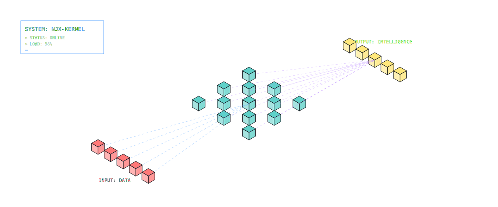

<div align="center">
  
</div>

<div align="center">
  <h3><code>NJX-70B-Instruct</code></h3>
  <p><em>Interactive Model Visualization. Click the nodes above to navigate the system architecture.</em></p>
</div>

---

<!-- Terminal / IDE Layout -->
<table>
<tr>
<td valign="top" width="25%">

### 📂 Explorer

```bash
.
├── 📁 core_identity
│   ├── bio.txt
│   └── config.json
├── 📁 research_frontiers
│   ├── vision.py
│   ├── llm.py
│   └── agents.py
├── 📁 deployments
│   ├── yolo_pt
│   └── gemini-cli
└── 📁 telemetry
    └── stats.log
```

<br/>

### 🧠 Model Arch

```yaml
# NJX-Internal-v1
architecture:
  input:
    - source: "Curiosity"
    - dtype: "Raw_Data"
  encoder:
    - layer: "CS_Fundamentals"
    - activation: "Deep_Learning"
  attention:
    - heads: ["Vision", "LLM"]
    - mechanism: "System_Design"
  decoder:
    - task: "Engineering"
    - output: "Innovation"
```

<br/>

### 📦 Packages

```
pip list
─────────────────────
PyTorch        2.x
Transformers   4.x
YOLO           v8
LangChain      0.3
vLLM           latest
OpenCV         4.x
FastAPI        0.11x
Docker         ██████
Linux          ██████
Git            ██████
```

<br/>

### 📊 Status

```
$ htop --sort=priority
─────────────────────
 PID  PRI  TASK
 001  ■■■  LLM Inference
 002  ■■■  Vision Models
 003  ■■○  Embodied AI
 004  ■○○  Blog Writing
─────────────────────
 CPU [████████░░] 80%
 MEM [██████░░░░] 60%
 UPT  4y @ BIT · CS
```

<br/>

### 📜 Git Log

```
$ git log --oneline
─────────────────────
e4f2c1a Exploring
        embodied AI
b7a31d0 Building
        inference infra
9c82ef1 Fine-tuning
        LLMs (PEFT)
3a1b0c2 YOLO detection
        pipeline
1f0e9d8 First commit
        @ BIT CS
```

</td>
<td valign="top" width="75%">

<h3 id="user-content-core-identity"><code>cat core_identity/bio.txt</code></h3>

> **"Bridging the gap between SOTA Research and Production Engineering."**

I treat AI research not just as academic exploration, but as **system architecture**. My goal is to understand the emergent properties of large models and engineer the infrastructure that makes them accessible.

*   **Affiliation**: Beijing Institute of Technology (BIT) · CS
*   **Focus**: AI Inference, Model Architecture, Embodied Intelligence

---

<h3 id="user-content-research-frontiers"><code>python3 research_frontiers/main.py</code></h3>

```python
class ResearchInterests(nn.Module):
    def __init__(self):
        super().__init__()
        self.vision = "Vision Transformers (ViT), Object Detection (YOLO)"
        self.llm = "Architecture Design, PEFT, KV Cache Optimization"
        self.agents = "Multi-Agent Orchestration, Tool Use & Planning"
        self.infra = "High-performance Inference, Quantization"

    def forward(self, x):
        return self.agents(self.llm(self.vision(x)))
```

---

<h3 id="user-content-selected-deployments"><code>ls -la deployments/</code></h3>

| Permission | Owner | Name | Description | Status |
| :--- | :--- | :--- | :--- | :--- |
| `drwxr-xr-x` | `njx` | **[YOLOv8-pt](https://github.com/NJX-njx/YOLOv8-pt)** | Optimized vision pipeline (+18% speed) |  |
| `drwxr-xr-x` | `njx` | **[gemini-cli](https://github.com/NJX-njx/gemini-cli)** | Terminal-native multimodal assistant |  |
| `drwxr-xr-x` | `njx` | **[explainai](https://github.com/NJX-njx/explainai)** | Visualizing attention maps & Grad-CAM |  |
| `drwxr-xr-x` | `njx` | **[game-demo](https://github.com/NJX-njx/game-demo)** | WebGL/WebGPU physics playground |  |

---

<h3 id="contact-api"><code>curl https://njx-njx.github.io/api/v1/contact.json</code></h3>

```bash
# Initialize connection handshake (try it!)
curl -s https://njx-njx.github.io/api/v1/contact.json | python3 -m json.tool
```

```jsonc
// Server Response
{
  "status": "200 OK",
  "message": "Connection established. Ready to collaborate.",
  "blog": "https://njx-njx.github.io",
  "email": "3771829673@qq.com",
  "github": "https://github.com/NJX-njx",
  "latency": "12ms"
}
```

</td>
</tr>
</table>

---

<h3 id="user-content-telemetry"><code>cat telemetry/stats.log</code></h3>

<div align="center">
  <!-- GitHub Trophies -->
  <a href="https://github.com/ryo-ma/github-profile-trophy">
    
  </a>
  <br/>
  <br/>
  <!-- GitHub Stats & Activity -->
  <p>
    
    
  </p>
</div>

---

<div align="center">
  <a href="mailto:3771829673@qq.com"><code>[ POST REQUEST ]</code></a> · 
  <a href="https://njx-njx.github.io"><code>[ GET BLOG ]</code></a> · 
  <a href="https://github.com/NJX-njx"><code>[ GET REPO ]</code></a>
</div>
